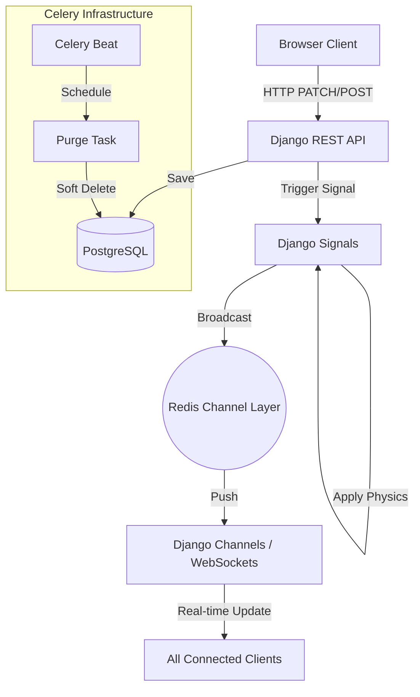

# Backend Architecture 🪐

Orbit's backend is a high-concurrency real-time engine designed for anonymity and tactile interaction.

## 1. Overview & Core Principles

- **REST-first write model**: All state changes happen via standard HTTP API calls for robust validation and permission checks.
- **Signal-Driven Broadcast**: Real-time updates are reactive. The database remains the true state, and WebSockets only announce changes.
- **Stateless Identity**: The "Ghost ID" system allows participation without traditional sessions or cookies.

---

## 2. System Design



---

## 3. Data Architecture (Database Schema)

### 3.1 `identity.AnonymousProfile`

The anchor for all user interactions.

- `ghost_id`: UUID (Primary Key) - Unique identifier generated on the client.
- `user`: ForeignKey(User, null=True) - Links to a registered account if claimed.
- `is_pro`: Boolean - Flag for premium status.
- `created_at`: Datetime - Used for the 30-day auto-purge policy.

### 3.2 `workspace.Board`

The container for feedback sessions.

- `id`: UUID (Primary Key).
- `creator_ghost`: ForeignKey(AnonymousProfile).
- `title`: String.
- `is_public`: Boolean.
- `secret_admin_token`: UUID - "Master Key" stored in client's LocalStorage for admin actions.

### 3.3 `workspace.Note`

Individual feedback items on the canvas.

- `board`: ForeignKey(Board).
- `creator_ghost`: ForeignKey(AnonymousProfile).
- `content`: Text.
- `color`: ChoiceField (Custom Palette).
- `position_x / position_y`: Float - Global coordinates relative to canvas origin (0,0).
- `upvotes_count`: Integer (Denormalized for performance).

---

## 4. Real-time Infrastructure (Messaging)

Each broadcast event follows a strict JSON structure to ensure the frontend can update its cache without re-fetching.

**Example: `NOTE_MOVED` Event**

```json
{
  "type": "note_moved",
  "payload": {
    "id": "uuid-1234",
    "position_x": 150.5,
    "position_y": -42.0,
    "last_updated_by": "ghost-abcd"
  }
}
```

---

## 5. Logic & Physics (The Gravity Engine)

Popularity is not just a number in Orbit; it's a physical force. In `signals.py`, we implemented a **Centripetal Force** algorithm:

1. When an upvote occurs, the backend calculates the vector between $(position\_x, position\_y)$ and $(0, 0)$.
2. The note is moved 5% closer to the origin.
3. This ensures that valuable feedback "clusters" in the center of the workspace naturally.

---

## 6. Engineering Reflections

### Why Django Channels + Redis?

We chose Channels over raw Node.js WebSockets to leverage Django's robust ORM and middleware. Redis acts as the "Event Bus," allowing us to scale vertically (more workers) or horizontally (multi-node Redis) while keeping sub-10ms broadcast latency.
